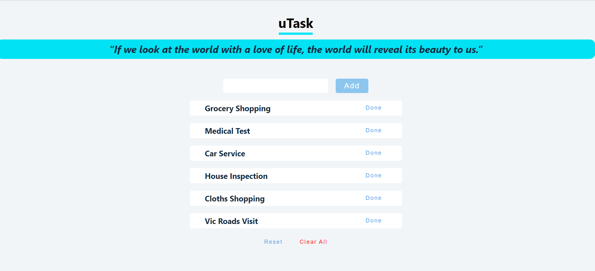
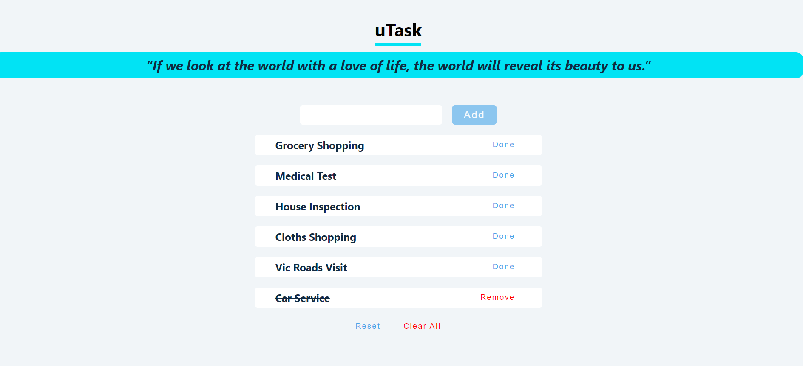
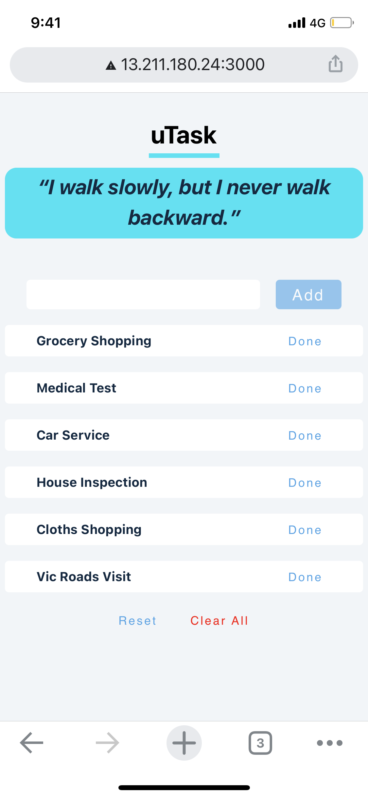
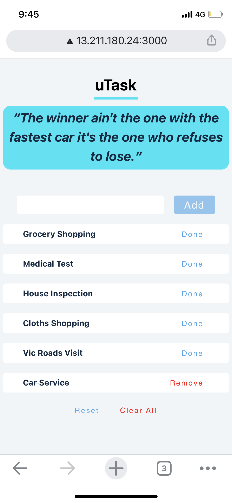

# uTask
uTask application is built on react js as a front end that will let users to add things to the list that are suppose to do in day to day life. This application will also motivate users with different motivational quotes everytime user refresh the page. 

## How to run the application 
1. Clone the application or fork.
2. Install all dependencies using `npm i` command 
3. Start the server with `npm start` command 
4. Go to http://localhost:3000 on your browser and start using the application 

## How to add items 
1. Click inside the text box next to add button 
2. click on `Add` button 
3. You should be able to see the item you have added in the list 

## User stories 
- A user can view inspirational quotes on top of the page 
- A user can add new items 
- A user can perform `Done` next to item added in the list 
- A user can remove the item from list by clicking on `Remove` button next to item completed 
- A user can clear all items in the list with `Clear All` button 

Future Features 
- User can create mutilple to do lists and able to added items to created lists 
- User authentication will be implemented 

## Frontend Dependencies
- Node 
- React 
- Axios 

## Backend Dependencies 
- Node 
- Express 
- mysql 
- body-parser 
- cors
- nodemon 

## What the app looks like 
- Web Application (Desktop version)

- Mobile Web Application

 
  

<!-- 
 -->

